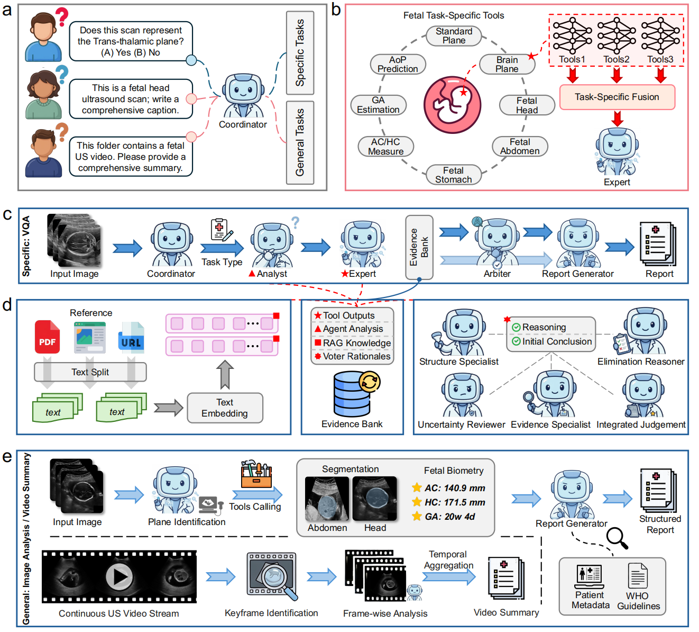

# FetUSAgents: Towards Reliable Fetal Ultrasound Interpretation with Multi Agent Collaboration

<p align="center">
  
</p>
<p align="center">
  <i><b>Figure 1.</b> Overview of the FetUSAgents framework. The system routes user requests to specific-task or general-task workflows, invokes task-specific Expert Agents for visual evidence acquisition, integrates tool outputs with multi-agent deliberation through DPEA, and uses retrieval-enhanced evidence consolidation to support grounded report generation, image captioning, and video summarization.</i>
</p>

## 1. Dataset and FetUS-VQA

| Task | Training Data | Test Data | VQA |
|------|---------------|-----------|-----|
| AC Estimation | [ACOUSLIC-AI](https://acouslic-ai.grand-challenge.org/overview-and-goals/) | [AC-Data](https://github.com/vahidashkani/Fast-U-Net/tree/main) | [VQA](https://github.com/hu2274898/FetUSAgents/blob/main/FetUS-VQA/vqa_ac_estimation.json) |
| AoP Estimation | [PSFHS](https://zenodo.org/records/10969427) | [JNU-IFM](https://figshare.com/articles/dataset/JNU-IFM/14371652) | [VQA](https://github.com/hu2274898/FetUSAgents/blob/main/FetUS-VQA/vqa_aop_estimation.json) |
| Brain Sub-plane Classification | [FETAL PLANES DB](https://zenodo.org/records/3904280) | [Brain-Data](https://zenodo.org/records/14093338) | [VQA_Binary](https://github.com/hu2274898/FetUSAgents/blob/main/FetUS-VQA/vqa_brain_subplane_binary.json) & [VQA_Multi](https://github.com/hu2274898/FetUSAgents/blob/main/FetUS-VQA/vqa_brain_subplane_multi.json) |
| GA Estimation | [FETAL PLANES DB](https://zenodo.org/records/3904280) | [HC18](https://hc18.grand-challenge.org/) | [VQA_Binary](https://github.com/hu2274898/FetUSAgents/blob/main/FetUS-VQA/vqa_GA_binary.json) & [VQA_Multi](https://github.com/hu2274898/FetUSAgents/blob/main/FetUS-VQA/vqa_GA_multi.json)|
| HC Estimation | [HC18](https://hc18.grand-challenge.org/) | [African-Data](https://zenodo.org/records/7540448) | [VQA](https://github.com/hu2274898/FetUSAgents/blob/main/FetUS-VQA/vqa_hc_estimation.json) |
| Plane Classification | [FETAL PLANES DB](https://zenodo.org/records/3904280) | [African-Data](https://zenodo.org/records/7540448) | [VQA_Binary](https://github.com/hu2274898/FetUSAgents/blob/main/FetUS-VQA/vqa_plane_binary.json) & [VQA_Multi](https://github.com/hu2274898/FetUSAgents/blob/main/FetUS-VQA/vqa_plane_multi.json)|
| Stomach Segmentation | [Abdominal Structures](https://data.mendeley.com/datasets/4gcpm9dsc3/1) | [Stomach-Data](https://zenodo.org/records/14093338) | [VQA](https://github.com/hu2274898/FetUSAgents/blob/main/FetUS-VQA/vqa_stomach_estimation.json) |

## 2. Installation
### 2.1 Clone
```bash
git clone https://github.com/<your-org>/FetUSAgents.git
cd FetUSAgents
```
### 2.2 Base environment
```bash
conda create -n fetusagents python=3.10
conda activate fetusagents
pip install -e .            # or:  pip install -r requirements.txt
pip install -r requirements-dev.txt   
```
### 2.3 Tool environments
This project relies on multiple model backends with different dependencies. In our internal setup, we use separate environments for different tool families.

Example environment groups:

fetus_base1: AoP-SAM, UPerNet, nnU-Net, GA-RadImageNet, GA-ConvNeXt

fetus_base2: FetalCLIP-based plane / sub-plane / GA tools

fetus_base3: SAMUS-based segmentation, video key-frame detection

fetus_base4: CSM HC measurement, FU-LoRA plane classification

fetus_base5: USFM-based AoP / HC tools

Example setup commands for these auxiliary environments are provided in **ENVIRONMENTS.md**. If you already have compatible research environments, you can reuse them and only set the environment variables below. If you already have compatible research environments, you can reuse them and only set the environment variables below.
## 3. Checkpoints

The weights of all tools (vision models) should be placed in the FetalAgent_ckpt/ folder.

Place the `FetalAgent_ckpt/` bundle anywhere on disk and point`paths.local.yaml` at it:

```text
/your/workspace/
├── FetUSAgents/                 # this repository 
└── FetalAgent_ckpt/             # released by me QwQ
```

Then set `fetalagent_ckpt_dir` in `configs/paths.local.yaml` — or export
`FETALAGENT_CKPT_DIR=/abs/path/to/FetalAgent_ckpt` directly.

## 4. Configuration

```bash
cp configs/paths.example.yaml configs/paths.local.yaml
$EDITOR configs/paths.local.yaml
```

Required keys (the orchestrator code is part of the package, so only
runtime paths and the LLM endpoint need filling in):

```yaml
paths:
  fetalagent_ckpt_dir: /abs/path/to/FetalAgent_ckpt
  rag_db_path:         /abs/path/to/fetal_ultrasound_knowledge_db
python_envs:
  hxt_base_python:        /abs/path/to/envs/hxt_base/bin/python
  fetalclip_python:       /abs/path/to/envs/fetalclip/bin/python
  fetalclip2_python:      /abs/path/to/envs/fetalclip2/bin/python
  experiment_aaai_python: /abs/path/to/envs/experiment_aaai/bin/python
  usfm_python:            /abs/path/to/envs/USFM/bin/python
  nnunet_predict:         /abs/path/to/envs/hxt_base/bin/nnUNetv2_predict
llm:
  openai_model:    gpt-5.1
  openai_base_url: https://api.openai.com/v1
```

- `rag_db_path` is the Chroma persist directory used by the RAG step.

- Set `OPENAI_API_KEY` via the environment (`configs/env.example` shows
the full export list).

- `paths.local.yaml` is gitignored.

## 5. Usage

### 5.1 Specific VQA — single image

```bash
python -m fetusagents \
  --query "Which anatomical plane is shown in this fetal ultrasound? (A) Fetal abdomen (B) Fetal femur (C) Fetal brain (D) Fetal thorax" \
  --input src/fetusagents/example_images/brain_thalamic/315_HC.png \
  --output_dir outputs/vqa_plane \
  --save_report
```

### 5.2 Open-ended image caption

```bash
python -m fetusagents \
  --query "This is a fetal head ultrasound scan; write a comprehensive caption for it." \
  --input src/fetusagents/example_images/brain_thalamic/315_HC.png \
  --output_dir outputs/caption_brain \
  --save_report
```

### 5.3 Video summary

```bash
python -m fetusagents \
  --query "This folder contains continuous screenshots of a fetal US video. Please provide a comprehensive summary." \
  --input src/fetusagents/example_images/video \
  --output_dir outputs/video_summary \
  --save_report
```

## 6. Citation

```bibtex
@misc{hu2026reliablefetalultrasoundinterpretation,
      title={Towards Reliable Fetal Ultrasound Interpretation with Multi-Agent Collaboration}, 
      author={Xiaotian Hu and Mingxuan Liu and Junwei Huang and Kasidit Anmahapong and Yifei Chen and Yiming Huang and Xuguang Bai and Zihan Li and Hongjia Yang and Yingqi Hao and Hong Xu and Yu Jiang and Tian Tian and Yi Liao and Haibo Qu and Qiyuan Tian},
      year={2026},
      eprint={2605.25357},
      archivePrefix={arXiv},
      primaryClass={cs.CV},
      url={https://arxiv.org/abs/2605.25357}, 
}
```

## 7. Acknowledgements

We gratefully acknowledge the contributions of the following projects:
[FetalCLIP](https://github.com/13204942/FetalCLIP),
[AoP-SAM](https://github.com/13204942/AoP-SAM),
[SAMUS](https://github.com/xianlin7/SAMUS),
[nnU-Net](https://github.com/MIC-DKFZ/nnUNet),
[USFM](https://github.com/openmedlab/USFM),
[Chroma](https://github.com/chroma-core/chroma), and
[AutoGen](https://github.com/microsoft/autogen).


